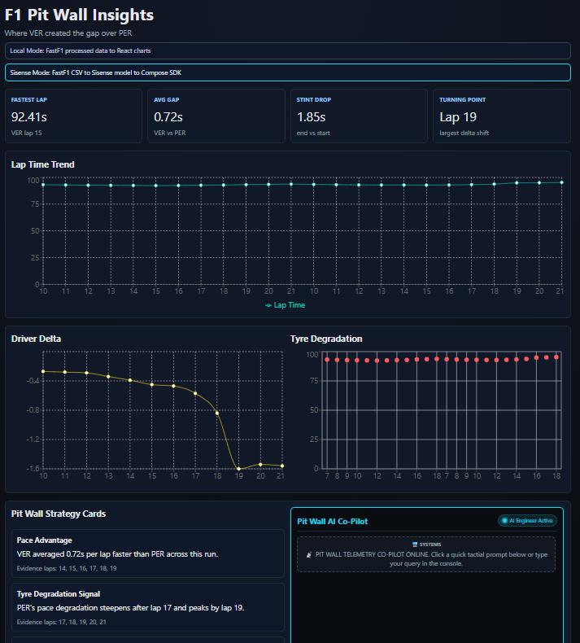

# F1 Pit Wall Insights

From raw F1 telemetry to a pit-wall decision dashboard builders can run locally and later connect to Sisense.



## What Is This

F1 Pit Wall is a React + Vite + TypeScript demo built for the Sisense Build and Tell challenge.

🚀 **[Play with the Live Demo (Vercel)](https://your-project-name.vercel.app)**  
*(Currently running in fast Local Mode. Sisense Mode can be enabled by configuring a Sisense data model).*

It shows a practical builder journey:
- Local Mode: run instantly with processed data
- Sisense Mode: switch to a real Compose SDK integration path

Core message:
Vibe coding can generate dashboards quickly.
Sisense Compose SDK turns that dashboard into embedded analytics builders can ship.

## Features

- F1 decision-focused dashboard (VER vs PER comparison)
- KPI cards: fastest lap, avg gap, stint drop, turning point
- Lap trend, driver delta, tyre degradation, and insight cards
- Local fallback with no credentials
- Sisense Mode boundary with `SisenseContextProvider`
- Compose SDK proof component: `SisenseLapTimeChart`
- Graceful warning when Sisense env vars are missing

## Quick Start

```bash
cd frontend
npm install
npm run dev
```

Open:
`http://localhost:5173`

## Run Modes

Create `frontend/.env.local`.

### Local Mode (default)

```env
VITE_ANALYTICS_PROVIDER=local
```

### Sisense Mode

```env
VITE_ANALYTICS_PROVIDER=sisense
VITE_SISENSE_URL=https://your-sisense-instance
VITE_SISENSE_TOKEN=your-api-token
VITE_SISENSE_DATASOURCE=F1_Pit_Wall
```

If Sisense config is missing, the app stays up and shows:
`Sisense Mode requires VITE_SISENSE_URL, VITE_SISENSE_TOKEN, and VITE_SISENSE_DATASOURCE. Switch to Local Mode or configure Sisense.`

## Compose SDK Setup

1. Create Sisense Trial
2. Upload processed F1 CSVs
3. Identify data source name
4. Generate data model file:

```bash
npx @sisense/sdk-cli get-data-model \
  --url <SISENSE_URL> \
  --token <SISENSE_TOKEN> \
  --dataSource "<DATA_SOURCE_NAME>" \
  --output src/sisense/f1-data-model.ts
```

5. Set `.env.local` with Sisense vars and restart

## Why Builders Care

- Build fast in local mode without waiting on platform setup
- Keep architecture ready for embedded analytics from day one
- Swap from prototype charts to governed analytics with minimal UI churn

## Repo Structure

```text
frontend/
  src/analytics/providers/
  src/components/sisense/
  src/sisense/f1-data-model.ts
strategy/strategy-brief.md
content/linkedin-post.md
prompts/
```
