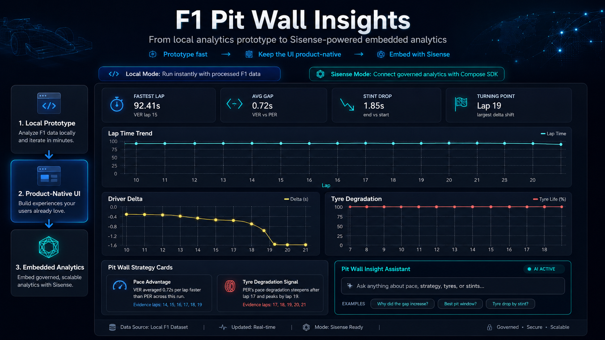

# F1 Pit Wall Insights

**Prototype analytics fast. Keep the UI product-native. Grow into Sisense-powered embedded analytics.**



<p align="center">
  <a href="https://frontend-two-tau-54.vercel.app"><strong>Live Demo</strong></a> ·
  <a href="https://github.com/lugypresko/sisense-test/tree/feature/compose-sdk-mode"><strong>GitHub Repo</strong></a> ·
  <a href="https://notebooklm.google.com/notebook/b7b9326b-3728-4bc0-9502-e5f505da2b52/artifact/e5cbe26e-cbcd-4fc2-b756-db9857be4e29?"><strong>Explainer</strong></a>
</p>

---

## Start Here

The top-of-funnel CTA is **not**:

> Sign up for Sisense.

It is:

> **Fork this repo. Add analytics to your React app in under 10 minutes.**

This prototype is the acquisition channel.

It is live, forkable, and designed around a real developer workflow:

```text
local prototype → product-native analytics UI → Sisense-powered embedded analytics
```

The first value moment requires **no signup, no token, and no platform setup**.

Run it locally, see the dashboard working, then connect Sisense Compose SDK when you are ready for governed embedded analytics.

---

## The Idea

Modern builders do not start inside a BI platform.

They start with a product idea.
They vibe-code a prototype.
They test the experience locally.
They shape the UI around the real user workflow.
Only then do they connect the product to governed analytics infrastructure.

**F1 Pit Wall Insights** demonstrates that journey.

It starts as a local React analytics app powered by processed Formula 1 telemetry data, then shows how the same product-native experience can evolve into embedded analytics with **Sisense Compose SDK**.

In short:

> AI helps builders create dashboards faster.  
> Sisense helps builders turn those dashboards into analytics products.

---

## Fork & Run in Under 10 Minutes

```bash
git clone https://github.com/lugypresko/sisense-test.git
cd sisense-test/frontend
npm install
npm run dev
```

Open:

```text
http://localhost:5173
```

By default, the app runs in **Local Mode**.

You get a working analytics dashboard immediately using processed F1 data.
No Sisense account is required for the first run.

---

## Aha Moment: See It Work Before Signup

The developer should reach the moment of:

> “This actually works in my stack.”

before any signup wall.

That is why the first experience runs locally:

- no Sisense account
- no token
- no data source setup
- no ElastiCube build dependency
- no blocked onboarding flow

The goal is to let a developer see a real chart, inside a real React app, against real data — immediately.

Once the local experience makes sense, Sisense becomes the natural upgrade path.

---

## What This Repo Shows

This is not just an F1 dashboard.

It is a developer acquisition workflow:

1. Prototype fast with local data
2. Keep the UI fully product-native
3. Add an analytics provider boundary
4. Connect Sisense Compose SDK as the governed analytics layer
5. Move toward embedded analytics without throwing away the prototype

The important point:

> The repo does not demo Sisense features first.  
> It solves a builder problem first — then shows where Sisense fits.

---

## Why Builders Care

Vibe coding makes it easier than ever to generate dashboards.

But fast dashboard generation is not the same as shipping analytics inside a real product.

Builders still need:

- governed data models
- reusable analytics components
- embedded analytics inside the app UI
- secure access to metrics
- a path from prototype to production
- minimal UI churn when moving from local data to real analytics infrastructure

This repo demonstrates the bridge.

```text
Prototype locally
      ↓
Validate the product experience
      ↓
Add an analytics provider boundary
      ↓
Connect Sisense Compose SDK
      ↓
Ship embedded analytics
```

---

## Demo Experience

The app presents an F1 pit-wall style decision dashboard.

Current example:

**VER vs PER comparison**

The dashboard includes:

- fastest lap comparison
- average gap
- stint drop
- turning point
- lap time trend
- driver delta
- tyre degradation
- pit-wall strategy cards
- insight assistant panel

The experience is intentionally built to feel like a product feature, not a standalone BI report.

---

## Run Modes

Create:

```bash
frontend/.env.local
```

### Local Mode

Local Mode runs the dashboard using processed local F1 data.

```env
VITE_ANALYTICS_PROVIDER=local
```

Use this mode when you want to:

- run the demo immediately
- review the product experience
- test the UI without platform setup
- explore the analytics flow before connecting Sisense

---

### Sisense Mode

Sisense Mode activates the Compose SDK integration path.

```env
VITE_ANALYTICS_PROVIDER=sisense
VITE_SISENSE_URL=https://your-sisense-instance
VITE_SISENSE_TOKEN=your-api-token
VITE_SISENSE_DATASOURCE=F1_Pit_Wall
```

If the Sisense configuration is missing, the app does not crash.

It stays up and shows a graceful warning:

```text
Sisense Mode requires VITE_SISENSE_URL, VITE_SISENSE_TOKEN, and VITE_SISENSE_DATASOURCE.
Switch to Local Mode or configure Sisense.
```

This is intentional.

A builder should be able to explore the product experience even before the analytics backend is fully connected.

---

## Activation: `npm install` Is the Signup

In this funnel, activation is not a form fill.

Activation happens when a developer installs the SDK and starts evaluating Sisense inside their own app.

```bash
npm install @sisense/sdk-ui
```

That command is the real product-led growth signal.

A developer who runs it has moved from watching a demo to actively testing Sisense as part of their stack.

---

## Why Sisense?

A local dashboard proves the product idea.

Sisense Compose SDK shows how that idea can become a real embedded analytics experience.

With Sisense, the app can move from:

- local files to governed data models
- hardcoded chart logic to reusable analytics components
- prototype visuals to embedded analytics inside the product UI
- one-off dashboard code to a scalable analytics layer

The goal is not to replace the product experience with a BI iframe.

The goal is to keep the product experience custom, while letting Sisense power the analytics behind it.

---

## What Makes This Different

Most analytics demos start inside the BI tool.

This one starts where modern builders actually start:

- local code
- fast iteration
- AI-assisted development
- product-native UI
- a real workflow
- a path to governed analytics

The dashboard is intentionally built with a provider boundary so the app can run in two modes:

- **Local Mode** — fast, zero-friction prototype
- **Sisense Mode** — embedded analytics integration path using Compose SDK

---

## Architecture

```text
Processed F1 Data
      ↓
Analytics Provider Boundary
      ↓
┌────────────────────┬────────────────────────┐
│ Local Provider      │ Sisense Provider        │
│                    │                         │
│ Local data files    │ Compose SDK components  │
│ Fast prototype      │ Embedded analytics path │
└────────────────────┴────────────────────────┘
      ↓
F1 Pit Wall Dashboard
      ↓
Product-native analytics experience
```

The key architectural choice is the analytics provider boundary.

The dashboard should not care whether the data comes from local files or from Sisense.
That keeps the prototype fast while preserving a clean path toward production-grade embedded analytics.

---

## Compose SDK Setup

To connect the app to Sisense:

1. Create a Sisense Trial environment
2. Upload the processed F1 CSV files
3. Identify the Sisense data source name
4. Generate the data model file

```bash
npx @sisense/sdk-cli get-data-model \
  --url <SISENSE_URL> \
  --token <SISENSE_TOKEN> \
  --dataSource "<DATA_SOURCE_NAME>" \
  --output src/sisense/f1-data-model.ts
```

5. Add the Sisense environment variables to `frontend/.env.local`
6. Restart the frontend

```bash
npm run dev
```

---

## Implementation Status

### Implemented

- React + Vite + TypeScript frontend
- Local dashboard experience
- F1 pit-wall decision UI
- VER vs PER comparison flow
- KPI cards
- lap trend visualization
- driver delta view
- tyre degradation view
- pit-wall strategy cards
- local analytics provider
- Sisense mode configuration boundary
- `SisenseContextProvider`
- Compose SDK proof component: `SisenseLapTimeChart`
- graceful fallback when Sisense environment variables are missing

### Ready For Extension

- full Sisense-backed chart replacement
- additional Compose SDK components
- more race datasets
- multi-driver comparison
- multi-race comparison
- AI-generated pit-wall race summary
- public technical walkthrough
- StackBlitz / CodeSandbox browser-first version

---

## Suggested Builder Extensions

Good first forks:

- add another F1 race dataset
- add HAM vs RUS comparison
- replace one local chart with a Sisense Compose SDK chart
- add a race strategist recommendation panel
- add an AI-generated post-race summary
- add support for multiple race sessions
- deploy the frontend to Vercel
- add a short technical screencast

---

## PLG Strategy: How This Converts Builders

This repo is designed as a developer-led growth motion.

### Step 1 — Acquisition

The prototype itself is the acquisition channel.

The CTA is:

> Fork this repo. Add analytics to your React app in under 10 minutes.

A developer should not need to understand Sisense first.
They should understand the problem first:

> “I have a React app. I need analytics inside it. I do not want to rebuild the UI later.”

### Step 2 — Aha Moment

The aha moment must happen in under five minutes.

The developer sees a live analytics experience working locally, with no signup wall.

Best next improvement:

> Add a StackBlitz or CodeSandbox embed so builders can see a live chart rendering in the browser immediately.

### Step 3 — Activation

Activation happens when the developer installs the SDK:

```bash
npm install @sisense/sdk-ui
```

That is the moment they move from passive observer to active evaluator.

### Step 4 — Expansion

After the first local win, the repo should guide the developer toward:

- replacing local data with Sisense queries
- generating a governed data model
- embedding analytics components in their own app
- turning a dashboard prototype into an analytics product

---

## Repo Structure

```text
frontend/
  src/
    analytics/
      providers/
    components/
      sisense/
    sisense/
      f1-data-model.ts

strategy/
  strategy-brief.md

content/
  linkedin-post.md

prompts/
```

---

## Positioning Summary

This repo is a proof of a modern analytics builder journey:

> Start with a fast local prototype.  
> Keep the experience product-native.  
> Use Sisense Compose SDK to grow it into embedded analytics.

It is not just a racing dashboard.

It is a small example of how developers can build analytics features the way modern software is built:

**fast first, product-native, then governed and scalable.**
