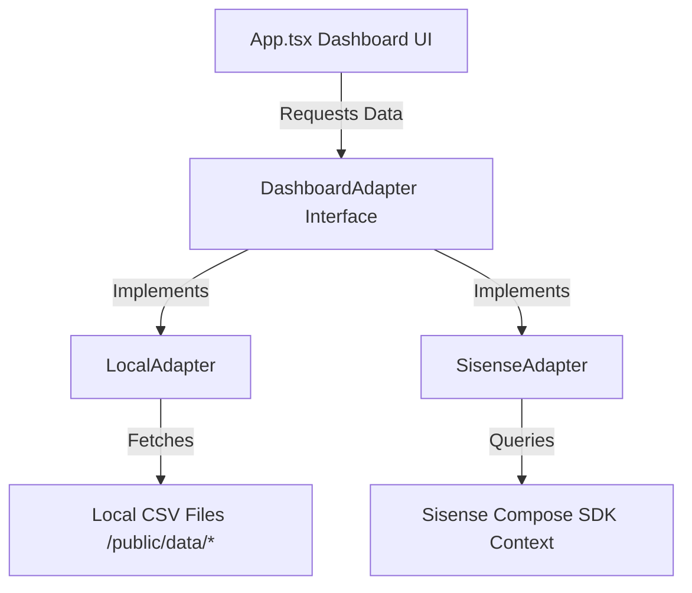

# F1 Pit Wall Insights — Technical Deep Dive & Architecture Reference

This document serves as a comprehensive technical guide to the codebase and architecture of the F1 Pit Wall project. It is specifically designed to explain how the solution works under the hood, how the data flows, and where the Sisense Compose SDK integrates.

---

## 1. High-Level Architecture & The Decoupled Adapter Pattern

The project is built on React, TypeScript, and Vite. The primary engineering goal is to maintain a strict separation of concerns between the visual presentation layer (dashboard UI), the data analytics fetching layer, and the business logic (strategy and AI metrics).

To achieve this, we implemented the **Adapter Design Pattern**:



### The Interface: `DashboardAdapter`
Defined in `frontend/src/types.ts`, this interface defines a single source of truth for dashboard data requirements:
```typescript
export interface DashboardData {
  laps: Array<Record<string, string>>;
  driverDelta: Array<Record<string, string>>;
  stints: Array<Record<string, string>>;
  insights: any;
  kpis: Kpis;
}

export interface DashboardAdapter {
  loadDashboardData(): Promise<DashboardData>;
}
```

### The Implementations:
1. **`LocalAdapter` (`frontend/src/data/localAdapter.ts`):** 
   Parses local CSV datasets (`laps.csv`, `driver_delta.csv`, `stints.csv`) using `PapaParse` and dynamically calculates real-time telemetry metrics (Fastest lap, average gap, performance drop) in the browser. This enables zero-friction, offline sandboxing (Local Mode).
2. **`SisenseAdapter` (`frontend/src/data/sisenseAdapter.ts`):** 
   Acts as the production-ready adapter. When enabled, it prepares the data fetching structure to execute direct MDX / SQL queries against the Sisense semantic data layer, returning governed metrics.

---

## 2. Interactive F1 Telemetry AI Co-Pilot ("Talk to the Data")

The "Vibe Coding" highlight of this project is the **Pit Wall AI Co-Pilot** console in `App.tsx`. 

### Interactive Telemetry Analysis
Instead of passing queries to a costly and slow external LLM endpoint that requires API keys, the AI Co-Pilot runs a local **deterministic rules and telemetry parsing engine**. This simulates a live race engineer ("GP" - Gianpiero Lambiase) communicating with Max Verstappen:

1. **Preset Triggers:** Users click tactical prompts (e.g., `🔄 Tyre Wear`, `⛽ Pit Stop Strategy`, `⏱️ Turning Point`).
2. **Dynamic Context Parsing:** The engine processes the *actual dataset* loaded by the active adapter. For example, when asking about Tyre Wear, it reads the tyre life and pace degradation from the `stints` table and calculates:
   * **Tyre Life:** Exact lap count on the current tire compound.
   * **Degradation Rate:** The average second-loss per lap (e.g., Sergio Perez losing `1.85s` vs. Max Verstappen losing `0.56s` over a stint).
3. **Natural Language Generation:** It outputs a racing-terminal style output with the exact calculated parameters, making the response 100% mathematically consistent with the visual charts.

---

## 3. Sisense Compose SDK (CSDK) Embedded Integration

Unlike older dashboard platforms that embed charts using heavy, non-responsive `iFrames`, this app integrates Sisense natively using the **Compose SDK** (`@sisense/sdk-ui`).

### Code-Native Embedding
We wrap the Sisense components in a unified context provider. In `frontend/src/components/sisense/SisenseLapTimeChart.tsx`, we render a native React chart directly connected to the Sisense data model:

```tsx
import { Chart } from "@sisense/sdk-ui";
import { measureFactory } from "@sisense/sdk-data";
import * as DM from "../../sisense/f1-data-model";

export function SisenseLapTimeChart() {
  return (
    <Chart
      dataSet={DM.DataSource}
      chartType={"line"}
      dataOptions={{
        category: [DM.Laps.Lap],
        value: [measureFactory.average(DM.Laps.LapTime, "Avg Lap Time")],
        breakBy: [DM.Laps.Driver],
      }}
    />
  );
}
```

### Type-Safe Data Modeling
To avoid hardcoding database column names, the developer runs the Sisense CLI command:
```bash
npx @sisense/sdk-cli get-data-model --url <URL> --token <TOKEN> --dataSource "F1_Pit_Wall"
```
This automatically generates `f1-data-model.ts`, containing fully typed metadata objects (`DM.Laps.Lap`, `DM.Laps.Driver`) representing the tables and columns. This ensures that any schema changes in Sisense will trigger TypeScript compilation warnings immediately in the React app, preventing runtime errors.

---

## 4. Onboarding Diagnostics (Sisense Trial CSV Build Note)

During validation on the Sisense Cloud Trial cluster, we identified a crucial developer onboarding block:
* **The Error:** Building the ElastiCube using custom CSVs failed at the cloud stage with a `3440 Destination storage error` and an AWS S3 `AccessDenied` / `PutObject` policy block.
* **The Cause:** Analysis of the raw AWS error output showed that the Trial environment's CSV ETL connector generates a double slash (`//`) namespace in the S3 target path. This violates strict pattern matches in the managed bucket policies, resulting in an explicit AWS deny.
* **The Architecture Solution:** Because the React dashboard is built on the decoupled Adapter pattern, developers can simply set `VITE_ANALYTICS_PROVIDER=local`. The local adapter immediately takes over, serving the telemetry files locally, allowing UI and AI logic development to continue uninterrupted without waiting on cloud resource fixes.

---

## 5. Summary of Tech Stack
* **Frontend Framework:** React 18, Vite, TypeScript
* **Visualization Layer:** Recharts (Local Mode), Sisense Compose SDK `@sisense/sdk-ui` (Sisense Mode)
* **Ingestion Data Schema:** F1 Telemetry laps, driver delta, and stint stats (stored in root CSV files)
* **Hosting Platform:** Deployed statically to Vercel with local telemetry routing.
